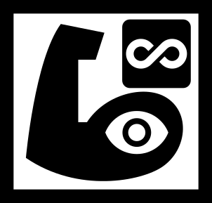

<p align="center">
  
</p>

<p align="center">
  <a href="https://github.com/olsonjeffery/ofm/blob/main/LICENSE"></a>
  <a href="https://github.com/olsonjeffery/ofm/actions"></a>
  <a href="https://www.rust-lang.org"></a>
  <a href="https://deps.rs/repo/github/olsonjeffery/ofm"></a>
</p>

<p align="center">
  <strong>Orchestration Force Multiplier (ofm)</strong>
  <strong><a href="https://github.com/olsonjeffery/ofm">GitHub repository</a></strong>
</p>

<p align="center">
  A specification-level fork of <a href="https://github.com/vdaubry/bottega">bottega</a> by <a href="https://github.com/vdaubry">@vdaubry</a> 
</p>

<p align="center">
    (Pronounce it as an acronym: oh-eff-em)
</p>

<p align="center">
  <strong><ins>ACHTUNG!<br />ACHTUNG!<br />ACHTUNG!</ins><br />⚠️ ofm is alpha-quality software ⚠️</strong>
</p>

<p align="center">
🏃🏾‍♀️ <strong>TL;DR</strong> An orchestration harness for coding agent activity 🏃🏾‍♀️<br />
🎯 Centering a kanban-like authoring lifecycle (especially for software) 🎯<br />
🫱🏻‍🫲🏿 A structured, web-based workflow mediating between users and coding agents 🫱🏻‍🫲🏿 <br />
📈 Aims to increase productivity in the time and quality domains 📈
</p>

## Core attributes

### Capability 💪

- The system provides a more rigid structure around the [_Ralph Wiggum Loop_][1]
(hereafter referred to as _orchestration_ or simply _the loop_), helping users
to spend more time producing high-quality software, instead of fighting with the
agent harness
- Simultaneously, we don't want _too much structure_; that only stifles agility
and burns countless tokens on redundancy checks (looking at you, [opencode-swarm][18])
- An intuitive, web-based user interface creates an environment that enables
users to focus on defining requirements and providing needed feedback to LLM agents,
instead of thrashing with tooling or environment setup
- `playwright-cli` comes out of the box as an agent capability

### Visibility 👁️

- `ofm` preserves logs of agent activity it drives; Full JSON export and import is
supported
- All prompts are surfaced and auditable; no secret sauce or dumbing-down for users
- The web-based user interface and kanban style task board provides at-a-glance
snapshots of current progress; the task-level view highlights points of interactivity
or needed user intervention to get a coding agent back on-track

### Flexibility ♾️

- All prompts can be changed on a global, per-project and/or per-user
basis
- The [`opencode`][17] open-source, multi-provider capable coding agent harness
is the built-in provider
- The user _owns_ the local installations of the coding agent, so they can customize
then with whatever skills, safeguards, etc are appropriate for the user case or
organizational requirements; This avenue of customization provides a positive feedback
loop into the Capability attribute

## Why AGPL 3.0 for the license?

> ℹ️`ofm` has plans to develop an out-of-process extension mechanism, so
> organizations that need proprietary integration can place such code
> within a unit that sits outside of the AGPL 3.0 boundary, but integrates
> seamlessly with `ofm`

`ofm` is [Free Software][12] in the purest sense of the term: It cannot be taken
closed source _by anyone_ (including the founding author); It can be productized,
yet all changes must be contributed back into the public repository for the benefit
of all.

Any organization who adopts the system internally has nothing to fear from the
license terms. They are meant to discourage productization without contributing
back to the upstream.

Opening issues and contributing is encouraged for those wishing to extend the
core/optional capabilities of `ofm`.

## Installation

At this time, `ofm` is started/ran by cloning this repository, then executing:

```bash
cargo build --release && <NEEDED-OAUTH-ENV-VARS> ./target/release/ofm
```

> ℹ️In the future there will likely be a docker image distro, along with possibly
> a [crates.io][19] bin release.

Note the placement of `<NEEDED-OAUTH-ENV-VARS>` in the above snippet; on first
run, the installing individual will want to indicate which OAuth provider
should be used: Either an external OAuth provider, or the integrated [rauthy][5]
provider.

**Rauthy users can simply provide:**

```bash
# This value drives ofm using docker to run the latest rauthy
# img released on ghcr.io
OFM_RAUTHY_ENABLED=true
```

...as a prefix to the `./target/release/ofm` command.

> ℹ️**NOTE FOR RAUTHY USERS**: On first run, the console output will include
> an admin password generated by rauthy for the initial user (username
> `admin@localhost`); This password must be captured and used to do an initial
> login; After that, the user can change their password by going to the
> "Settings" dropdown in the `ofm` top navbar and choosing Account)

> ℹ️**RAUTHY CLEANUP**: Stopping `ofm` removes its rauthy container
> (`docker rm -f ofm-rauthy-<footprint-hash>`). If `ofm` is SIGKILLed, the
> container is left behind but is automatically reaped on the next start of
> the same `OFM_FOOTPRINT`. Leftover containers can be listed with
> `docker ps --filter name=ofm-rauthy`.

> ℹ️**RAUTHY VIA OFM'S `/auth` PROXY**: The browser reaches the embedded rauthy
> **exclusively through `ofm`'s `/auth` route** — a single `OFM_PORT` serves
> both the `ofm` webapp and rauthy's login/oidc endpoints. All absolute URLs
> (`ofm`'s OIDC redirect URI, the post-logout URI, rauthy's `PUB_URL`, and the
> rauthy `clients.json` redirect URIs) derive from `ofm`'s public URL, which is
> set with `OFM_PUB_URL` (legacy alias: `OFM_URL`). Set `OFM_PUB_URL` to the
> externally-visible origin when `ofm` runs behind a reverse proxy.
>
> ⚠️**`OFM_PUB_URL` CHANGE ON AN EXISTING FOOTPRINT**: rauthy imports the `ofm`
> client's redirect URIs (built from `OFM_PUB_URL`) only on first initialization;
> afterwards they are persisted in rauthy's DB at `{OFM_FOOTPRINT}/rauthy/data`
> and are never re-imported. If you change `OFM_PUB_URL` (or the port-derived
> default) on an existing rauthy-enabled footprint, `ofm` detects the change on
> the next start and automatically deletes that data volume so the new redirect
> URIs take effect — note this resets any rauthy users created in the admin UI
> (the bootstrap admin account is recreated, with its password printed at
> startup, and its OIDC identity gets a fresh `sub`). Your `ofm` login still
> works after the re-bootstrap: `ofm` re-links the existing user row to the new
> subject on the next login, so settings/projects are retained. Previously issued
> rauthy tokens are invalidated (you'll be logged out once). If you are upgrading
> from an `ofm` version that predates this
> detection **and** changing `OFM_PUB_URL`/`OFM_PORT` in the same move, delete
> `{OFM_FOOTPRINT}/rauthy/data` (or the whole footprint) once yourself before
> restarting.

**Installations using an OAuth provider will want to provide:**

```bash
# This is the OAuth "base" (i.e. .well-known/openid-configuration)
# should be *beneath* this URL
OFM_OIDC_ISSUER_URL=https://path.to/oauth/issuer-base
# This is the client used in the web application for OIDC; it should
# be configured for Code Authorization flow and PKCE
OFM_OIDC_CLIENT_ID=ofm.client
```

Either of these approaches will initialize the `ofm` footprint at `$HOME/.ofm`
by default (provide `OFM_FOOTPRINT={path}` to customize this).

In either case: after the first run of `ofm`, this OAuth preference will be
persisted in `$OFM_FOOTPRINT/config/ofm.yml`, so future runs of `ofm` will
not need to provide this (unless the user has a custom `OFM_FOOTPRINT` location;
then that env var should be set on every run of `ofm`).

At this point, you should have a server bounding to `0.0.0.0` and reachable at
`localhost:3183` running on your machine (`3183` is the default port; Set the `OFM_PORT`
environment variable if you wish for it to run on another port).


> ℹ️`ofm` itself _does not_ consider running with a certificate/TLS+SSL as in-scope.
> It is also recommend, if planning to expose `ofm` on the public internet, to
> place `ofm` behind a reverse proxy such as `nginx`/`haproxy` etc and doing SSL
> termination there.
>
> If encrypted traffic is mandatory within your organization, then `ofm` should
> have the enclosing reverse proxy as an on-machine sidecar, with the `ofm` ports
> blocked by a software firewall for non-localhost users.

> ℹ️**REVERSE PROXY / MULTI-HOST**: `ofm` binds a single port (`OFM_HOSTNAME` +
> `OFM_PORT`) and accepts any `Host` header — no host allowlist. Every absolute
> URL `ofm` builds (OIDC redirect URI, post-logout URI, embedded-rauthy `PUB_URL`
> and redirect URIs) derives from **one** configured public origin: `OFM_PUB_URL`
> (default `http://127.0.0.1:{OFM_PORT}`, derived from a `0.0.0.0` hostname as
> loopback). To run behind a proxy:
>
> ```bash
> OFM_HOSTNAME=0.0.0.0 \
> OFM_PUB_URL=https://ofm.example.com \
> OFM_PORT=3183 \
> cargo run
> ```
>
> and have the proxy forward `https://ofm.example.com/*` → `127.0.0.1:3183`.
> Browser logins route to the `OFM_PUB_URL` origin. When the embedded rauthy is
> used, its published port binds loopback only (`-p 127.0.0.1:{port}:8080`) and
> OFM's `/auth` reverse proxy derives `X-Forwarded-Host`/`X-Forwarded-Proto`
> from `OFM_PUB_URL` (client-supplied values are ignored) while appending the
> peer IP to `X-Forwarded-For`. The browser is always redirected to the
> `OFM_PUB_URL` origin for login — OFM re-hosts rauthy's advertised endpoints
> onto `pub_url` (rauthy's own URLs would otherwise be `http://...` and could
> leak a mis-set loopback host), and OFM's backend token/userinfo/JWKS calls go
> direct to rauthy at loopback. When you additionally enable
> `OFM_RAUTHY_PROXY_MODE=true`, rauthy hardcodes an `https://` issuer, so
> the `OFM_PUB_URL` origin must be TLS-terminated; you must also set
> `OFM_RAUTHY_TRUSTED_PROXIES` to the proxy CIDR(s) (including the Docker bridge
> subnet, e.g. `172.17.0.0/16`) or rauthy will block proxied requests. Changing
> `OFM_PUB_URL` on an existing rauthy-enabled footprint re-bootstraps rauthy
> automatically (see the rauthy note above).

## History & evolution

### The `bottega` method

`ofm` is descended from [`vdaubry/bottega`][2], which means it is
_task-driven_. What does this mean? From the [bottega announcement][14]:

> A task is not a prompt. A task is a requirement with acceptance criteria.
>
> The task itself, the requirement, and the technical specification must all
> coexist as enduring artifacts that live alongside the implementation, not
> transient inputs to a single session.

This philosphy colors how `bottega` & `ofm` organize, present and execute
work on behalf of its users. Note that these tasks, and their artifacts,
exist separately from any specification living within the codebase (this
applies to `ofm`).

Additionally:

- Tasks, memory and related documentation live **outside** of code repositories
and worktrees `ofm` is used on
- It's implementation is specification-based; everything starts at
`specs/SPEC.md`; read this to begin understanding _how_ `ofm` works and
what is in-scope
- It is a _web-based_ system, with limited CLI capabilities for onboarding and
agent tools only
- It is _multi-user_ and _persistent_ by design; It is meant for teams
that cooperate to ship software (it is also a pleasant system to run as a
solo programmer (the [Core attributes](#core-attributes) described above
articulate this more fully)
  - Provider configuration can be global and/or per-user
- It can run locally on a single developer's machine, within docker
automation, live on a shared VPS, etc; sky's the limit!
  - Being a Rust-based system, it aims for memory-efficiency; The _runtime_
  footprint (excluding agent sessions, but including any internal tools like
  memory, `rauthy`, etc) should be no more than two-to-three-hundred MB of RAM
    - supported agents has their own claims around memory-usage and can stand
    on their own
- In terms of the host Operating System: wherever it is running and whoever
it is running-as will be the user/environment that `ofm` works within
  - `ofm` has a _data footprint_ as well as its _system dependencies_
  (installed tools that `ofm` expects to be installed and available to the
  user)
  - apart from what's above, the rest (dev environment install, source control
  credential management, environment/secrets, etc) is the user's responsibility,
  which `ofm` works to remain ignorant-of

### Differences from `bottega`

It strays from the [bottega reference][13] in several ways:

- `ofm` is a single-binary release; It has a list of needed dependencies
in order to be _useful_, but the system itself is self-contained
- Reified as a [Rust][7]-based webapp, using the [leptos][3] framework;
`ofm` itself is an [axum][4]+[leptos][3] web-server that can run from
the CLI or be set up via a superviser system (e.g. [systemd][8])
- ⚠️**Requires OAuth2/OIDC for all [IAM][10]** ⚠️
  - `bottega` implements [its own authentication scheme][9] in the context
  of its reference implementation; _this is not appropriate_ for secure,
  production-ready deployments in an enterprise/organizational setting
  - `ofm` can be configured to either point at a well-known OAuth2/OIDC
  endpoint (where it will fetch the pub-cert for authenticating client requests
  on the server), or to install/run a self-hosted OAuth server (an audited tool
  named [rauthy][5])
- Several subtle tweaks on _vanilla_ `bottega` that reflect the tastes
of `ofm`'s founding author
- The task detail page is git-aware: it lists the task worktree's commits
(since the merge-base with the base branch, oldest→newest, refreshed on every
page load) and each commit opens a dedicated page with the changed-file list
and a two-column source diff. See `src/services/commits.rs` and
`src/webapp/pages/commit_detail.rs`.

## Contributing

### The `ofm` specification

**TL;DR:** All changes must include updates within the content of the `spec/`
directory in the root of this repository. It is often preferred for PRs/issues
to be articulated in terms of updates to the specification.

Like `bottega`, `ofm` is Specification First.

We maintain the `ofm` rust codebase as the de facto reference-implementation of
the spec.

Setting that aside, all `ofm` enhancements (besides outright bugfixes unrelated
to the specification) happen through refining & extending the [`ofm` spec][11].

### Vouching

`ofm` uses a **vouching** scheme for contributions. See [CONTRIBUTING.md](./CONTRIBUTING.md)
for details.

[1]: https://ghuntley.com/loop/
[2]: https://vdaubry/bottega
[3]: https://www.leptos.dev/
[4]: https://github.com/tokio-rs/axum
[5]: https://github.com/sebadob/rauthy
[7]: https://rust-lang.org/
[8]: https://systemd.io/
[9]: https://github.com/vdaubry/bottega/blob/main/extra/auth-and-multi-user.md
[10]: https://en.wikipedia.org/wiki/Identity_and_access_management
[11]: ./spec/SPEC.md
[12]: ./LICENSE
[13]: https://github.com/vdaubry/bottega/blob/main/SPEC.md
[14]: https://vdaubry.github.io/bottega-launch/

[16]: https://github.com/rtk-ai/rtk
[17]: https://opencode.ai
[18]: https://github.com/ZaxbyHub/opencode-swarm/
[19]: https://crates.io
